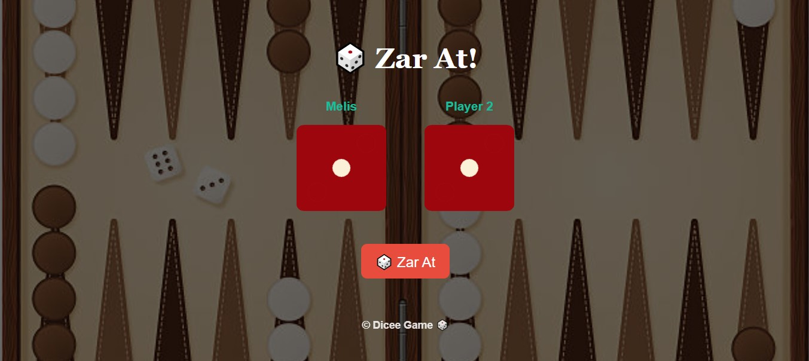
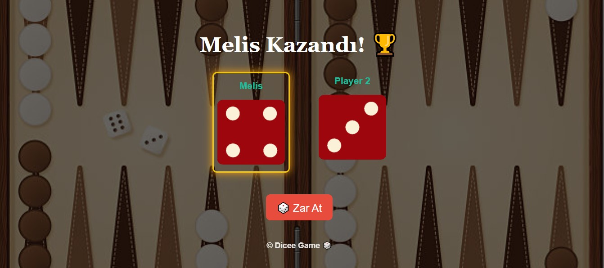
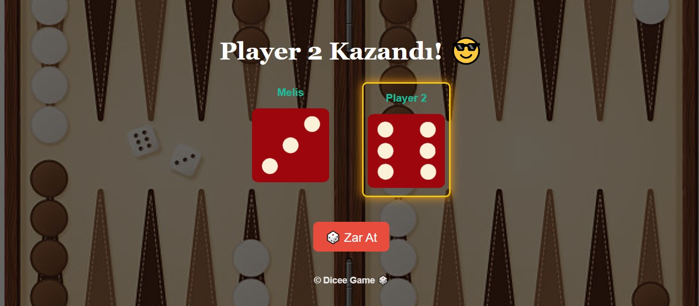
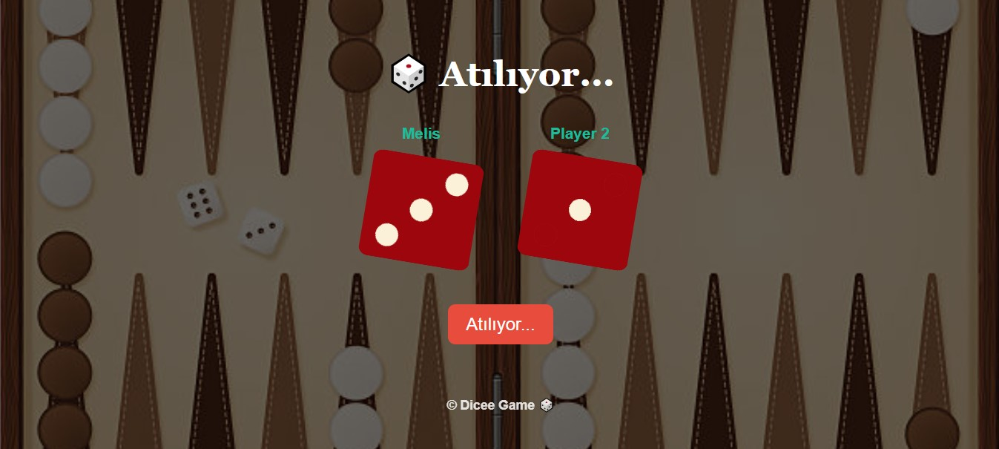
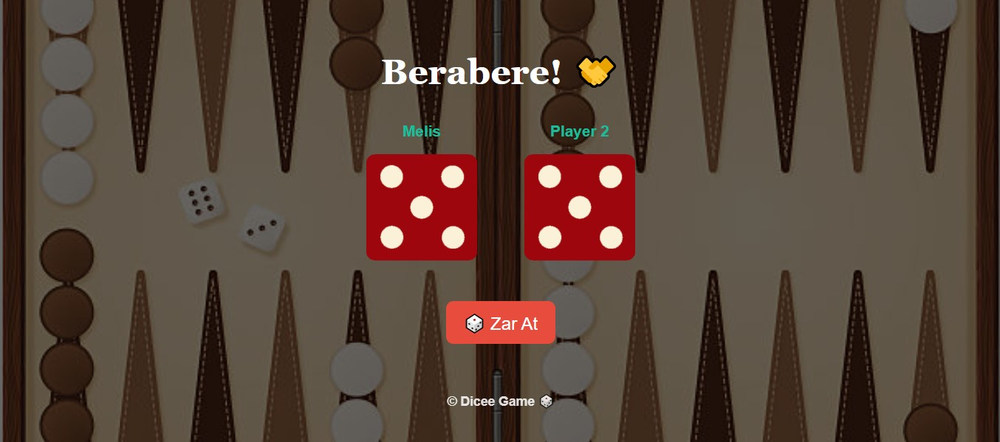

# 🎲 Dice Game (Zar Oyunu)

Bu proje, React.js kullanılarak geliştirilen bir zar atma oyunudur. Kullanıcı, bilgisayara (Player 2) karşı tek el zar atar. Zarlar döner, sonuçlar ekranda görüntülenir ve kazanan oyuncu animasyonla vurgulanır.

## 📸 Ekran Görüntüsü

## 🚀 Özellikler

- 🎮 Kullanıcı adı girme
- 🌀 Zarlar 3 saniye boyunca dönerek animasyon etkisi verir
- 🏆 Kazanan oyuncu ekranda vurgulanır (parlama animasyonu)
- 🎲 Zarlar rastgele atanır
- 📱 Responsive tasarım (mobil uyumlu)

## 🛠️ Kullanılan Teknolojiler

- [React.js](https://reactjs.org/)
- CSS (flex, animasyonlar, media queries)
- JavaScript ES6+ (useState, useEffect)

